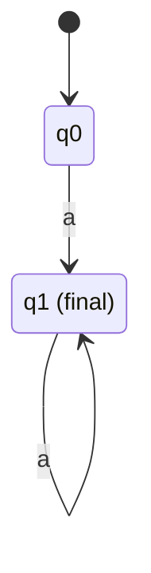

# Automatix

Ce projet étend automata-lib 9.2.0 sans modifier la bibliothèque originale.
Il requiert Python 3.11 ou une version ultérieure.

Notre code se trouve dans `automata_extensions/`. La copie de référence
upstream se trouve dans `reference/automata-lib/`, au tag `v9.2.0`, et doit
rester intacte. Le notebook se trouve dans `notebooks/sandbox.ipynb`.

## Installation

```powershell
conda activate automate-env-clean
python -m pip install -e .
```

Pour installer également la dépendance de développement pytest :

```powershell
python -m pip install -e ".[dev]"
```

Les méthodes `svg()`, `png()` et `pdf()` nécessitent aussi le programme
système Graphviz `dot`. Les exports texte `dot()`, `tikz()` et `latex()`
fonctionnent sans ce programme.

## Tests

```powershell
python -m pytest
```

Seuls les tests du dossier `tests/` sont collectés par défaut.

## Utilisation

```python
from automata_extensions.fa import ExtendedDFA, ExtendedNFA

dfa = ExtendedDFA(
    states={"q0", "q1"},
    input_symbols={"a"},
    transitions={"q0": {"a": "q1"}, "q1": {"a": "q1"}},
    initial_state="q0",
    final_states={"q1"},
)
assert dfa.accepts("a")
minimal = dfa.trim().minimize()

nfa = ExtendedNFA.from_regex("a*")
assert nfa.accepts("aa")
```

L'automate déterministe de l'exemple reconnaît les mots formés d'au moins un
`a` :



Les extensions couvrent les parcours et l'analyse de graphes, les opérations
sur les langages, la minimisation, les conversions entre automates,
expressions régulières et grammaires, les systèmes d'équations, les
morphismes, ainsi que l'export Graphviz. `ExtendedGNFA` est également
disponible dans `automata_extensions.fa` pour les opérations prises en charge.

## Suivi du projet

- `AGENTS.md` — règles de développement
- `docs/IMPLEMENTATION_STATUS.md` — suivi des 62 exigences
- `docs/decisions/` — décisions d'architecture
