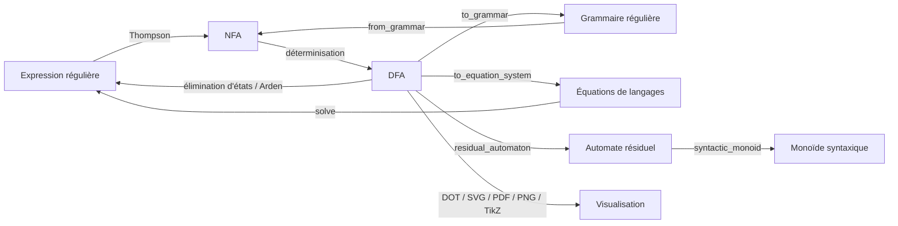
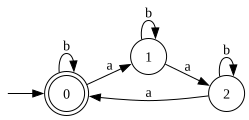

<div align="center">



**Une bibliothèque d'algorithmes pour explorer les automates et les langages formels.**


</div>

Automatix étend **[automata-lib](https://github.com/caleb531/automata)** 9.2.0 sans modifier son code. Ce projet académique réunit des algorithmes classiques et avancés de théorie des automates et des langages formels : DFA, NFA, ε-NFA, expressions régulières, grammaires régulières, équations de langages, quotients de Myhill–Nerode, automates résiduels, morphismes, monoïdes syntaxiques et visualisation.

## Pourquoi Automatix ?

| Explorer | Transformer | Relier les formalismes |
| :--- | :--- | :--- |
| 🧭 Parcours, accessibilité, cycles, composantes fortement connexes | 🔀 Opérations sur les langages et minimisation | 🤖 DFA, NFA et ε-NFA |
| 🔤 Dérivées et construction de Thompson | 📚 Grammaires et dérivations | 🧮 Équations rationnelles et lemme d'Arden |
| 🧩 Myhill–Nerode et automates résiduels | 🔗 Morphismes et monoïde syntaxique | 🎨 Graphviz, TikZ et LaTeX |

La [matrice des 62 fonctionnalités](docs/IMPLEMENTATION_STATUS.md) détaille les API, les tests et les choix de comportement.

### Un parcours entre représentations



Ce diagramme montre quelques conversions disponibles, pas toutes les opérations du package.

## Installation

**Prérequis : Python 3.11 ou plus.** La dépendance Python `automata-lib==9.2.0` est installée avec le package.

```bash
git clone https://github.com/Optimusp-prime/Automatix.git
cd Automatix
python -m pip install -e .
```

Pour lancer les tests du projet :

```bash
python -m pip install -e ".[dev]"
python -m pytest
```

Les exports `svg()`, `pdf()` et `png()` demandent également l'exécutable système **Graphviz `dot`** dans le `PATH` (`dot -V` permet de le vérifier). Les exports texte `dot()`, `tikz()` et `latex()` n'en ont pas besoin.

## Premiers pas

```python
from automata_extensions.fa import ExtendedDFA

dfa = ExtendedDFA(
    states={"q0", "q1"},
    input_symbols={"a"},
    transitions={"q0": {"a": "q1"}, "q1": {"a": "q1"}},
    initial_state="q0",
    final_states={"q1"},
)
print(dfa.accepts("aaa"))
print(dfa.trim().minimize().is_equivalent(dfa))
```

```text
True
True
```

L'automate reconnaît les mots contenant au moins un `a`. Les transformations renvoient de nouveaux objets et peuvent s'enchaîner.

## 🚀 20 fonctionnalités à découvrir

Les extraits suivants utilisent ce petit laboratoire commun. Copiez-le une fois, puis exécutez **n'importe lequel** des blocs ouverts ci-dessous. `d` est le DFA à trois états employé dans les tests de référence du projet ; `n` est un ε-NFA.

```python
from automata_extensions.fa import ExtendedDFA, ExtendedNFA
from automata_extensions.regex import Regex
from automata_extensions.equations import solve_arden, SystemOfEquations

d = ExtendedDFA(
    states={"0", "1", "2"}, input_symbols={"a", "b"},
    transitions={
        "0": {"b": "0", "a": "1"},
        "1": {"b": "1", "a": "2"},
        "2": {"a": "0", "b": "2"},
    },
    initial_state="0", final_states={"0"},
)
n = ExtendedNFA(
    states={"p", "q", "r"}, input_symbols={"a", "b"},
    transitions={
        "p": {"a": {"p", "q"}, "": {"r"}},
        "q": {"b": {"q"}}, "r": {"a": {"r"}},
    },
    initial_state="p", final_states={"q", "r"},
)
```

<details>
<summary><strong>01 — Explorer les états accessibles</strong> · parcours BFS</summary>

Le parcours part de l'état initial ; le tri rend l'affichage de l'ensemble stable.

```python
print(d.bfs(), sorted(d.accessible_states()))
```

Résultat : `['0', '1', '2'] ['0', '1', '2']`

</details>

<details>
<summary><strong>02 — Élaguer un automate</strong> · états utiles et trim</summary>

Ici, les trois états sont utiles et l'automate élagué est trim.

```python
print(sorted(d.useful_states()), d.trim().is_trim())
```

Résultat : `['0', '1', '2'] True`

</details>

<details>
<summary><strong>03 — Suivre un mot état par état</strong> · trace d'exécution</summary>

La trace contient les configurations successives, état initial compris.

```python
print(d.execution_trace("aaa"))
```

Résultat : `['0', '1', '2', '0']`

</details>

<details>
<summary><strong>04 — Composer des langages</strong> · union et complément</summary>

Un langage uni à son complément est universel.

```python
print(d.union(d.complement()).is_universal())
```

Résultat : `True`

</details>

<details>
<summary><strong>05 — Déterminiser un ε-NFA</strong> · construction par sous-ensembles</summary>

Le DFA obtenu reconnaît le même langage que `n`.

```python
print(n.determinize().accepts("a"), len(n.determinize().states))
```

Résultat : `True 3`

</details>

<details>
<summary><strong>06 — Retirer les ε-transitions</strong> · sans perdre le langage</summary>

Le résultat n'a plus de transition étiquetée par le mot vide.

```python
clean = n.remove_epsilon_transitions()
print(all("" not in row for row in clean.transitions.values()), clean.accepts("a"))
```

Résultat : `True True`

</details>

<details>
<summary><strong>07 — Dériver une expression régulière</strong> · Brzozowski</summary>

Après lecture de `a`, il reste à reconnaître `b` ou `c`.

```python
print(str(Regex("ab|ac").derivative("a")))
```

Résultat : `b|c`

</details>

<details>
<summary><strong>08 — Construire un NFA avec Thompson</strong> · Regex → NFA</summary>

La construction explicite accepte les mots sur `a` et `b` terminés par `a`.

```python
print(ExtendedNFA.from_regex("(a|b)*a", input_symbols={"a", "b"}).accepts("aba"))
```

Résultat : `True`

</details>

<details>
<summary><strong>09 — Minimiser à la Brzozowski</strong> · doubles renversements</summary>

La minimisation conserve le langage et renvoie ici trois états.

```python
mini = d.brzozowski_minimize()
print(mini.is_equivalent(d), len(mini.states))
```

Résultat : `True 3`

</details>

<details>
<summary><strong>10 — Convertir un DFA en Regex</strong> · élimination d'états</summary>

Une première voie de conversion produit cette expression.

```python
print(d.to_regex())
```

Résultat : `(b*|b*ab*a((b|ab*ab*a))*ab*)`

</details>

<details>
<summary><strong>11 — Convertir un DFA par Arden</strong> · équations de langages</summary>

Une seconde voie résout les équations associées au DFA.

```python
print(d.to_regex_arden())
```

Résultat : `b*(ab*a((ab*ab*a|b))*ab*|())`

</details>

<details>
<summary><strong>12 — Passer par une grammaire régulière</strong> · automate ↔ grammaire</summary>

La grammaire issue du DFA peut reconstruire un NFA qui reconnaît le même mot.

```python
grammar = d.to_grammar()
print(type(grammar).__name__, ExtendedNFA.from_grammar(grammar).accepts("aaa"))
```

Résultat : `Grammar True`

</details>

<details>
<summary><strong>13 — Voir une dérivation</strong> · du symbole initial au mot</summary>

La séquence explicite chaque étape menant à `aaa`.

```python
print(d.derivation_tree("aaa").sequence())
```

Résultat : `0 => a1 => aa2 => aaa0 => aaa`

</details>

<details>
<summary><strong>14 — Appliquer le lemme d'Arden</strong> · une équation</summary>

La solution de `X = aX ∪ b` est `a*b`.

```python
print(str(solve_arden(Regex("a"), Regex("b"))))
```

Résultat : `a*b`

</details>

<details>
<summary><strong>15 — Résoudre un système rationnel</strong> · API générale</summary>

Le même problème peut être formulé comme système d'équations de langages.

```python
system = SystemOfEquations(
    ("X",), {"X": {"X": Regex("a")}}, {"X": Regex("b")}
)
print(str(system.solve()["X"]))
```

Résultat : `a*b`

</details>

<details>
<summary><strong>16 — Découvrir les quotients de Myhill–Nerode</strong></summary>

Chaque quotient distinct correspond ici à une langue droite d'un état accessible.

```python
quotients = d.myhill_nerode_quotients()
print(len(quotients), [q.initial_state for q in quotients])
```

Résultat : `3 ['0', '1', '2']`

</details>

<details>
<summary><strong>17 — Construire l'automate résiduel</strong> · états canoniques</summary>

Les quotients deviennent des états nommés `q0`, `q1`, `q2`.

```python
print(sorted(d.residual_automaton().states))
```

Résultat : `['q0', 'q1', 'q2']`

</details>

<details>
<summary><strong>18 — Relier et projeter des automates</strong> · morphismes</summary>

L'identité est un morphisme ; une projection renomme ou efface des symboles ; un quotient fusionne des états.

```python
identity = {"0": "0", "1": "1", "2": "2"}
print(d.is_morphism_to(d, identity))
print(d.project({"a": "x", "b": None}).accepts("xxx"))
print(sorted(d.quotient_by({"0": "0", "1": "0", "2": "2"}).states))
```

Résultat :

```text
True
True
['0', '2']
```

</details>

<details>
<summary><strong>19 — Calculer le monoïde syntaxique</strong> · algèbre du langage</summary>

Le langage de `d` induit trois transformations distinctes.

```python
print(len(d.syntactic_monoid()))
```

Résultat : `3`

</details>

<details>
<summary><strong>20 — Exporter un automate</strong> · DOT, TikZ, LaTeX, SVG, PDF, PNG</summary>

Les trois premiers exports sont du texte ; les trois derniers sont des octets rendus par Graphviz. Le test affiche les signatures réellement obtenues sans écrire de fichier.

```python
print(d.dot().splitlines()[0])
print(r"\begin{tikzpicture}" in d.tikz())
print(r"\documentclass" in d.latex())
print(b"<svg" in d.svg(), d.pdf().startswith(b"%PDF"),
      d.png().startswith(b"\x89PNG\r\n\x1a\n"))
```

Résultat :

```text
digraph {
True
True
True True True
```

</details>

### L'automate rendu

L'image ci-dessous a été générée par `d.svg()` avec Graphviz, à partir du DFA utilisé dans les exemples. Elle montre ses trois états, les boucles `b` et le cycle `a`.



## Sous le capot

Automatix ajoute des classes étendues et des **mixins** cohérents à `automata-lib==9.2.0`, sans modifier la bibliothèque amont. Les transformations préservent la source et renvoient de nouveaux automates. Le code est typé, contrôlé avec mypy strict et couvert par les tests ; les décisions transversales sont consignées dans les [ADR](docs/decisions/).

```text
automata_extensions/
├── fa/          DFA, NFA, GNFA et mixins
├── regex/       expressions régulières et dérivées
├── grammar/     grammaires et dérivations
└── equations/   Arden et systèmes rationnels
```

## Qualité vérifiée

| Exigences | Tests | Typage | Visualisation |
| :---: | :---: | :---: | :---: |
| **62 / 62 VERIFIED** | **1248 passed · 0 skipped** | **mypy strict OK** | **Graphviz réel : SVG, PDF, PNG** |

La [matrice d'implémentation](docs/IMPLEMENTATION_STATUS.md) relie chaque exigence à son API et à ses tests ; les [décisions d'architecture](docs/decisions/) expliquent les choix durables du projet.
